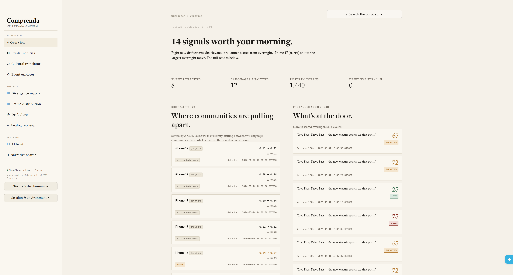
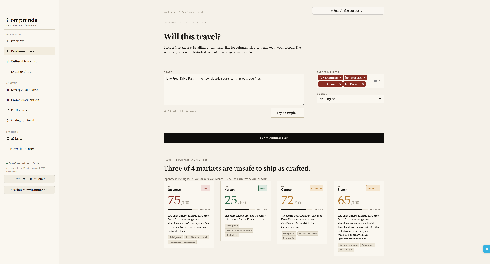
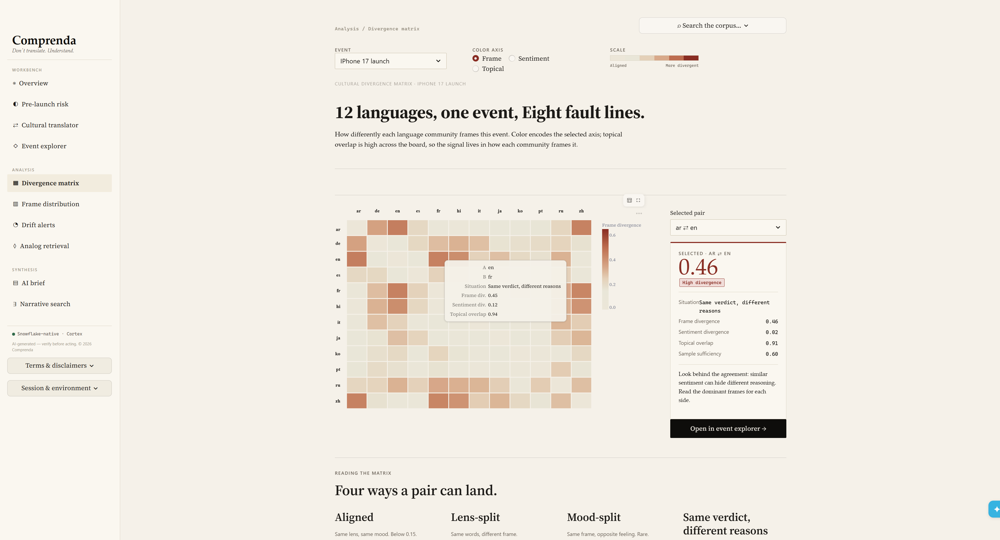
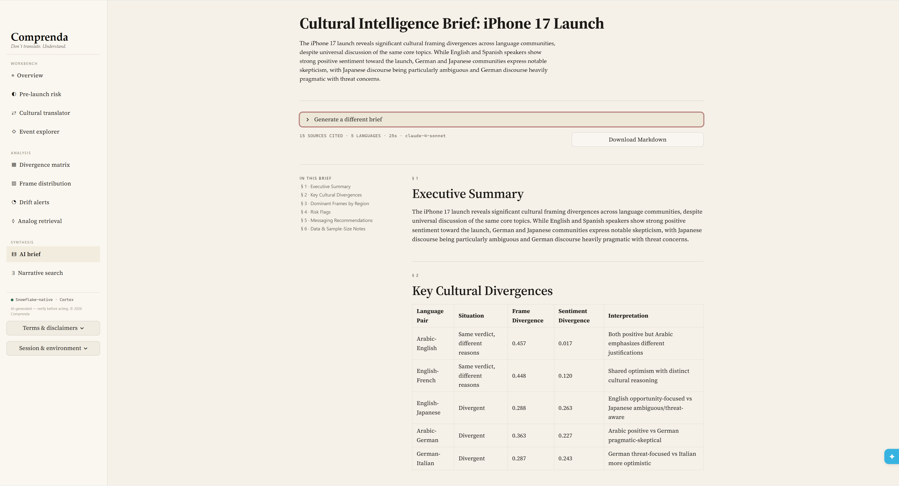

# Comprenda

**Cultural intelligence for the AI era. Don't translate — understand.**

Comprenda is a Snowflake-native SaaS that analyzes how global brand events land *differently* across language communities — not by translating to English and losing the signal, but by embedding and scoring content in its native language space. It is the successor to the working name *CulturePulse* and the production-ready realization of Novel Idea 2 from the Snowflake AI Projects Playbook.

> **On naming:** *Comprenda* is the product brand. *Nuance* was the internal codename, so it still appears in the repo, the database (`nuance_db`), and some file names — they all refer to the same project.

The wedge buyer at launch is **global brand and marketing teams** at mid-market consumer companies and boutique international PR agencies. They face a 2026-native problem: AI agents are now drafting their global marketing content, and they have no purpose-built tool to QA whether that content will land well in non-English markets. Comprenda solves this directly with a **Pre-Launch Cultural Risk Score** plus continuous post-launch monitoring.

---

## See it run

> **Live demo:** _‹paste your Streamlit Community Cloud URL here›_ · **5-min walkthrough:** https://youtu.be/15cbl7WS9cQ

The product is a **Streamlit-in-Snowflake** app. Two ways to see it:

- **Hosted demo — no Snowflake needed.** A fully interactive build on illustrative sample data, served from [`streamlit/demo_app.py`](streamlit/demo_app.py). Every page renders; the LLM-powered features (Pre-Launch Risk, Cultural Translator, AI Brief) show curated example outputs. It stubs the Snowflake connection, so it runs anywhere.
- **The real thing — inside Snowflake on Cortex.** Live multilingual embeddings, frame classification, Cortex Search, and Claude (via Cortex). `docs/12_post_rebuild_render_checklist.md` describes what each screen shows.

### See the screens

<!-- Capture these four per go_to_market/demo_script.md → "Portfolio stills to grab".
     Until the PNGs are saved into docs/img/ (see docs/img/README.md), GitHub renders
     broken-image icons here — capture first, or re-wrap this block in a comment to hide it. -->

| | |
|:--:|:--:|
|  |  |
| _Overview — 8 events · 12 languages · 1,440 posts._ | _Pre-Launch Risk — a 0–100 cultural-risk score per market, with sourced historical analogs._ |
|  |  |
| _Divergence matrix — frame-level Jensen-Shannon divergence across 12 languages._ | _AI brief — a source-cited synthesis with figures drawn from the corpus._ |

**Run the demo locally (no Snowflake, no credentials):**

```bash
cd streamlit
pip install -r requirements.txt
streamlit run demo_app.py
```

**Deploy it yourself (free):** [Streamlit Community Cloud](https://share.streamlit.io) → *New app* → this repo, branch `main`, **main file `streamlit/demo_app.py`**. It uses the light `streamlit/requirements.txt` (streamlit + pandas + altair) and serves fixture data — no Snowflake account or secrets. (Hugging Face Spaces works the same way.)

---

## What's in this repo

```
comprenda/
├── README.md                              ← you are here
├── CLAUDE.md                              ← engineering entry point + repo map
├── QUICKSTART.md                          ← deploy checklist
├── docs/                                  ← strategy + plan (read these first)
│   ├── 00_executive_summary.md
│   ├── 01_product_design.md
│   ├── 02_master_plan.md
│   ├── 03_runbook.md                      ← what YOU need to do
│   ├── 04_business_model.md
│   ├── 05_credit_budget.md
│   ├── 06_architecture.md
│   ├── 07_audit_and_fixes.md
│   ├── 08_build_session_transcript.md
│   ├── 09_streamlit_ops_runbook.md        ← how the live app is deployed
│   ├── 10_project_status.md               ← living snapshot + open items
│   ├── 11_ui_ux_design_brief.md
│   ├── 12_post_rebuild_render_checklist.md
│   ├── decisions/                         ← ADRs (numbered, append-only)
│   └── img/                               ← README gallery stills
├── snowflake/                             ← run these SQL files in Snowflake
│   ├── 00_bootstrap.sql                   ← single-command setup (warehouse, DB,
│   │                                         all tables, role, smoke tests — run this first)
│   ├── 05_embedding_pipeline.sql
│   ├── 06_frame_classification.sql
│   ├── 07_cds_computation.sql
│   ├── 08_cortex_search.sql
│   └── 09_alerts_and_tasks.sql
├── snowpark/                              ← Python UDFs + stored procedures (deploy scripts)
│   ├── deploy.py                          ← core UDFs + stored procedures
│   ├── deploy_plcs.py                     ← pre-launch risk scorer
│   ├── deploy_translator.py               ← cultural translator
│   ├── deploy_analog_retrieval.py         ← RAG analog retrieval
│   └── deploy_ai_brief.py                 ← AI brief synthesis
├── streamlit/                             ← the Comprenda app
│   ├── comprenda_app.py                   ← main entry (Streamlit-in-Snowflake)
│   ├── demo_app.py                        ← Snowflake-free public demo
│   ├── views/                             ← the multipage screens
│   ├── lib/                               ← theme, components, queries
│   └── environment.yml
├── semantic_model/
│   └── nuance_semantic_model.yaml         ← Cortex Analyst
├── native_app/                            ← Snowflake Native App / Marketplace (roadmap)
│   ├── manifest.yml
│   └── setup_script.sql
├── mcp/                                   ← MCP server (Claude Desktop / Cursor)
│   ├── nuance_mcp_server.py
│   └── README.md
├── data/                                  ← data ingestion scripts
│   ├── generate_demo_data.py              ← run this first for a fast demo
│   ├── download_gdelt.py
│   ├── download_huggingface.py
│   ├── load_to_snowflake.py
│   └── seed_analog_library.py             ← seeds the historical-analog case library
├── prompts/                               ← versioned prompts
│   ├── cultural_frame_classification.txt
│   ├── pre_launch_risk_scoring.txt
│   ├── cultural_translator.txt
│   └── ai_brief_synthesis.txt
├── go_to_market/                          ← launch kit
│   ├── landing_page.html
│   ├── demo_script.md                     ← portfolio walkthrough shot-list
│   ├── linkedin_portfolio_post.md
│   ├── linkedin_launch_post.md
│   ├── icp_and_prospects.md
│   ├── marketplace_listing.md
│   ├── product_hunt_copy.md
│   ├── cold_email_templates.md
│   ├── demo_script_investor.md
│   └── billing_config.json
└── archive/
    └── CulturePulse_original_plan.md      ← preserved for reference
```

---

## Quick start (minimum effort)

The full step-by-step is in **`docs/03_runbook.md`** — but the 30-second version:

1. Activate your Snowflake free trial at `app.snowflake.com` (gets you $400 in credits and 29 days).
2. Open a SQL worksheet, paste the contents of `snowflake/00_bootstrap.sql`, run it. This creates the warehouse, database, schemas, and all tables.
3. From your laptop: `pip install -r data/requirements.txt && python data/generate_demo_data.py` (synthetic but realistic multilingual demo data) and `python data/load_to_snowflake.py` (loads it into Snowflake).
4. Run `snowflake/05_embedding_pipeline.sql` through `snowflake/09_alerts_and_tasks.sql` in order. Each is idempotent and budget-aware.
5. In Snowflake → Projects → Streamlit → New, upload `streamlit/comprenda_app.py` and its `views/` directory. The app is live in your browser.

You're done. Total elapsed: ~45 minutes of mostly waiting for queries.

---

## Why this is a real business (one paragraph)

Every social-listening incumbent (Brandwatch, Meltwater, Sprinklr) translates first and then runs English-trained sentiment, which destroys the cultural signal — a known, documented, public failure mode. Comprenda keeps content in its native embedding space using Snowflake's multilingual `arctic-embed-l-v2.0`, scores it on a proprietary Cultural Divergence Score and a 12-category cultural frame taxonomy, and surfaces the results as structured data marketers can act on — both retrospectively and **before** a launch. Incumbents charge $800–$200K/year and don't offer self-serve trials; Comprenda charges $349–$1,290/month on Snowflake Marketplace with instant access. The product runs inside the customer's Snowflake account (Native App Framework), which makes it a 14× EBITDA business at exit rather than a 6–8× connected-SaaS business. The geopolitical-risk analytics market alone is $4B today and grows to $15B by 2035; the broader AI-in-social-media market goes from $3B to $48B+ by 2033. Total credit cost for the full MVP: under $400.
